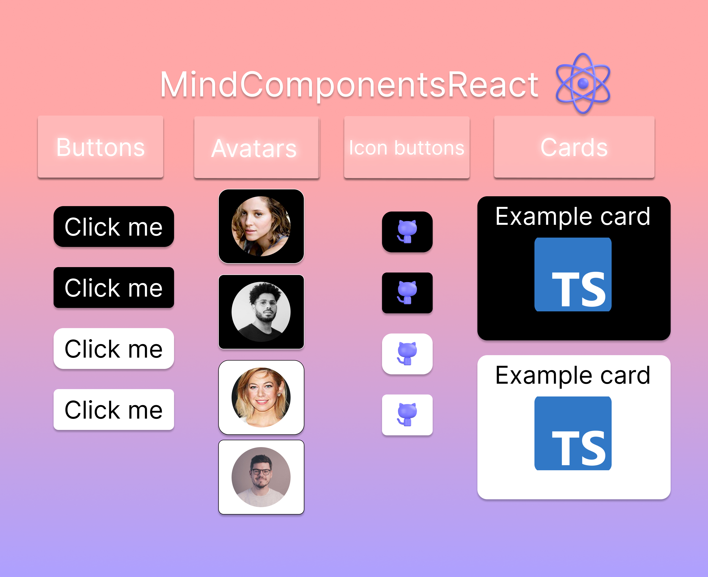

## MindComponentsReact



React component set

Special for [online library](https://github.com/MindBreakerGM/BookList)

### Installation


Npm
```
npm i mind-components-react
```
Yarn
```
yarn add mind-components-react
```

#### Examples
